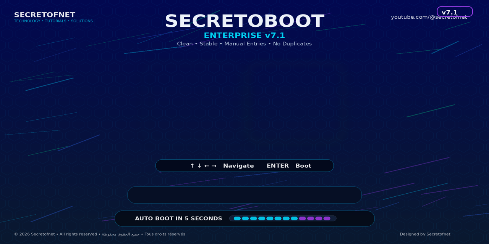
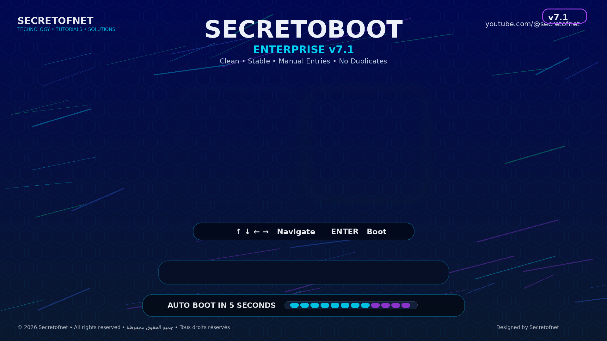

# SecretoBoot Enterprise v7.1 Stable

<p align="center">
  
</p>

**SecretoBoot Enterprise v7.1 Stable** is a professional rEFInd theme and installer for **Windows 11 + Google TV OS** dual boot.

> Designed by **Secretofnet** for a clean, stable, and duplicate-free boot experience.

---

## ✨ Features

- Professional enterprise-style rEFInd interface
- Windows 11 + Google TV OS manual boot entries
- No duplicate boot entries
- Google TV icon fix
- Automatic `refind.conf` backup
- One-click Windows installer
- Diagnostic and restore tools
- Documentation in Arabic, English, and French

---

## 📸 Screenshot



---

## 🚀 Installation

1. Download the latest ZIP from **Releases**
2. Extract the ZIP file
3. Open the `Scripts` folder
4. Right-click the installer file:
   ```text
   Install_SecretoBoot_Enterprise_v7_1.cmd
   ```
5. Choose **Run as administrator**
6. Reboot and test

---

## ✅ Requirements

- UEFI system
- rEFInd already installed
- Windows 11
- Google TV OS boot partition named `BOOT`
- Google TV loader located at:

```text
EFI\BOOT\BOOTx64.EFI
```

---

## 🔄 Backup and Restore

The installer creates a backup automatically before editing `refind.conf`.

To open the backup folder, run:

```text
Scripts\Open_Backups.cmd
```

Backups are stored inside:

```text
EFI\refind\backups
```

---

## 🧪 Check Configuration

To verify active rEFInd configuration, run:

```text
Scripts\Check_Active_Config.cmd
```

---

## 📚 Documentation

- [العربية](Docs/README_AR.md)
- [English](Docs/README_EN.md)
- [Français](Docs/README_FR.md)
- [Installation Guide](Docs/INSTALL.md)
- [FAQ](Docs/FAQ.md)

---

## ⚠️ Disclaimer

This project modifies rEFInd configuration files. Use it at your own risk. Always keep a backup of your EFI partition and important files before modifying boot settings.

---

## 👤 Author

Created by **Mohamed LALAH / Secretofnet**

YouTube: https://youtube.com/@secretofnet

© 2026 Secretofnet. All rights reserved.
